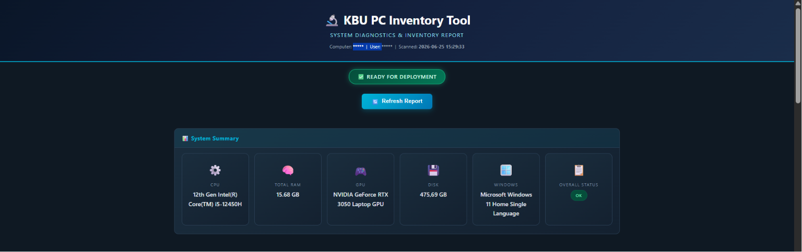
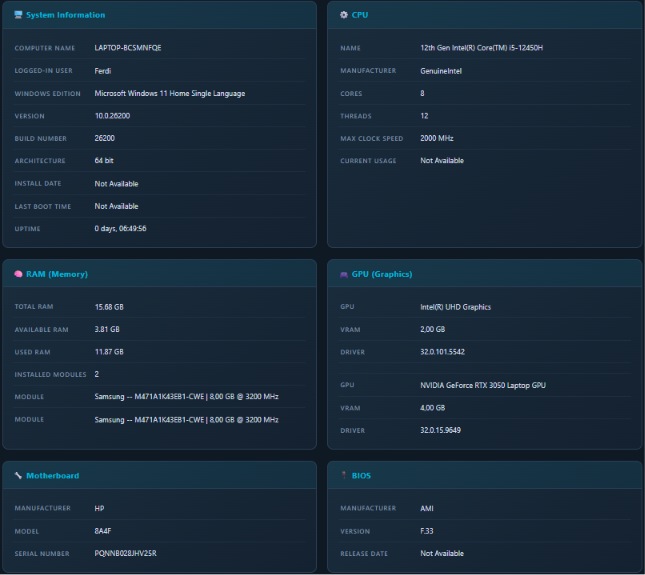
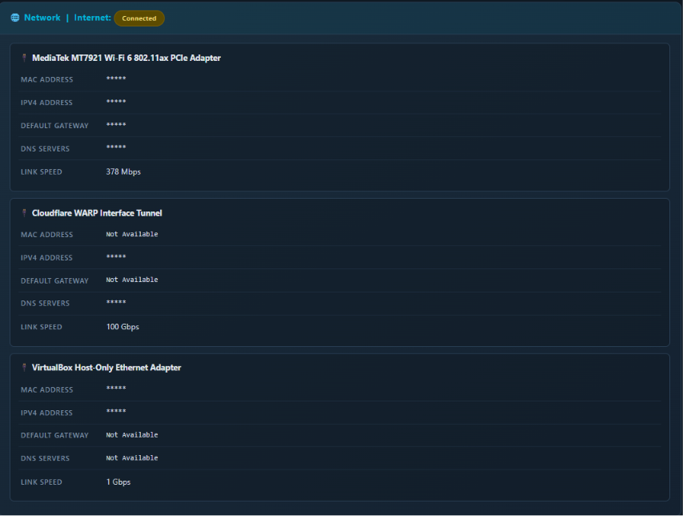
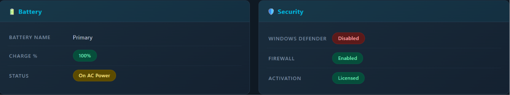

# KBU PC Inventory Tool

<div align="center">


**A professional Windows system inventory and diagnostics tool built with PowerShell.**

Automatically scan any Windows workstation and generate a modern, responsive HTML dashboard containing complete hardware, operating system, network, and security information — all without making a single modification to the target system.

[Features](#-features) &bull;
[Screenshots](#-screenshots) &bull;
[Installation](#-installation) &bull;
[Usage](#-usage) &bull;
[Architecture](#-architecture) &bull;
[License](#-license)

</div>

---

## Overview

**KBU PC Inventory Tool** is a read-only PowerShell application developed during a Software Engineering internship at **Karabuk University IT Department**. It was designed to solve a real operational need: quickly inspecting a workstation's complete hardware and software profile before deployment, troubleshooting, or asset documentation.

The tool queries Windows Management Instrumentation (WMI/CIM) to collect over 50 data points across 10 categories, then renders everything into a single self-contained HTML file with embedded CSS and JavaScript. The result is a polished, IT-grade dashboard that can be viewed in any browser — no server, no dependencies, no installation required.

The latest release introduces a built-in HTTP server with a **live refresh** capability, allowing IT personnel to re-scan a system directly from the browser with a single button click.

---

## Features

### Data Collection

| Category | Information Collected |
| :--- | :--- |
| **System** | Computer Name, Logged-in User, Windows Edition, Version, Build, Architecture, Install Date, Last Boot, Uptime |
| **CPU** | Model, Manufacturer, Physical Cores, Logical Threads, Max Clock Speed, Current Utilization |
| **RAM** | Total Capacity, Available, Used, Manufacturer, Part Number, Speed, Module Count, Per-Module Capacity |
| **GPU** | Adapter Name, VRAM, Driver Version — supports multi-GPU detection with dedicated GPU prioritization |
| **Storage** | Drive Letter, Model/Firmware, Media Type (SSD/HDD), Interface Type, Total/Used/Free Space, Health Status |
| **Motherboard** | Manufacturer, Product Name, Serial Number |
| **BIOS** | Vendor, Version, Release Date |
| **Network** | Active Adapters, MAC Address, IPv4, Default Gateway, DNS Servers, Link Speed, Internet Connectivity Status |
| **Battery** | Device Name, Charge Percentage, Power Status — laptops only |
| **Security** | Windows Defender Status, Windows Firewall Status, Windows Activation State |

### Dashboard Features

- **One-Click Scan** — Run the script and the report opens automatically in your default browser
- **Live Refresh** — Click the Refresh button in the browser to re-scan the system without restarting the tool
- **System Summary Card** — Critical components (CPU, RAM, GPU, Storage, Windows Version) at a glance
- **Deployment Readiness Check** — Large green badge displayed when no critical issues are found
- **Colored Status Badges** — Green (OK/Healthy), Yellow (Warning), Red (Error/Critical)
- **Disk Usage Progress Bars** — Visual storage consumption indicators per drive
- **Responsive Design** — Optimized for desktop, tablet, and mobile viewing
- **Print-Friendly** — Dedicated print stylesheet for clean hard-copy reports
- **Dark Theme** — Professional dark color scheme designed for IT environments

---

## Screenshots

<div align="center">

| | |
|:---:|:---:|
| **Dashboard Overview** | **Hardware Details** |
|  |  |
| **Network & Connectivity** | **Security Status** |
|  |  |

</div>

> To add your own screenshots, capture the HTML report from your browser and save them to the `screenshots/` directory. Recommended resolution: 1366x768.

---

## Technology Stack

| Layer | Technology |
| :--- | :--- |
| **Runtime** | Windows PowerShell 5.1+ |
| **Data Collection** | CIM / WMI (`Get-CimInstance`, `Win32_*` classes) |
| **HTML Generation** | PowerShell Here-Strings with embedded CSS & JavaScript |
| **Styling** | CSS3 (Flexbox, CSS Grid, Custom Properties, Keyframe Animations) |
| **Live Refresh** | `System.Net.HttpListener` (built-in .NET HTTP server) + AJAX (`XMLHttpRequest`) |
| **File Output** | Self-contained `.html` file with UTF-8 encoding |

**Zero external dependencies.** Everything uses built-in Windows components.

---

## Installation

### Prerequisites

- Windows 10 (64-bit) or Windows 11
- Windows PowerShell 5.1 or later (pre-installed on all supported Windows versions)
- Standard user permissions (no administrator rights required)

### Setup

```bash
# Clone the repository
git clone https://github.com/kbu-it/kbu-pc-inventory-tool.git

# Navigate to the project directory
cd kbu-pc-inventory-tool
```

No package managers, no `npm install`, no module imports. The script is fully self-contained.

---

## Usage

### Quick Start

**Right-click** `KBU_PC_Inventory.ps1` → **Run with PowerShell**

The script will:
1. Collect all system information (5-15 seconds)
2. Generate the HTML report
3. Save it to your Desktop as `KBU_PC_Inventory_Report.html`
4. Launch the built-in HTTP server
5. Open the dashboard in your default browser

### Command Line

```powershell
# Run with execution policy bypass (recommended)
powershell -ExecutionPolicy Bypass -File ".\KBU_PC_Inventory.ps1"

# Or from within a PowerShell session
.\KBU_PC_Inventory.ps1
```

### Execution Policy

If you see a script execution error, set the policy for the current user:

```powershell
Set-ExecutionPolicy -ExecutionPolicy RemoteSigned -Scope CurrentUser
```

This is a one-time configuration. The `-ExecutionPolicy Bypass` flag in the command-line examples avoids this step entirely.

### Live Refresh Mode

Once the dashboard is open in your browser:

1. Click the **Refresh Report** button at the top of the page
2. The tool re-scans all hardware and generates a fresh report
3. The page updates instantly — no manual reload required

The HTTP server runs on `http://localhost:58080` (auto-selects the next available port if busy).

---

## Example Output

### Console Output

```
+-----------------------------------------+
|   KBU PC Inventory Tool v1.0.0          |
|   Karabuk University IT Department      |
+-----------------------------------------+

  This tool is READ-ONLY -- No system modifications are made.

+-----------------------------------------+
|   PHASE 1: Data Collection              |
+-----------------------------------------+
  [->] Collecting System Information...
  [->] Collecting CPU Information...
  [->] Collecting RAM Information...
  [->] Collecting GPU Information...
  [->] Collecting Storage Information...
  [->] Collecting Motherboard Information...
  [->] Collecting BIOS Information...
  [->] Collecting Network Information...
  [->] Collecting Battery Information...
  [->] Collecting Security Information...

+-----------------------------------------+
|   PHASE 2: Generating HTML Report       |
+-----------------------------------------+
  [->] Building HTML report...

+-----------------------------------------+
|   LIVE SERVER STARTED                   |
+-----------------------------------------+
  URL: http://localhost:58080/
  Use Refresh button in browser to re-scan
  Press Ctrl+C or close this window to stop
```

### Quick Summary (console)

```
  ----------- Quick Summary -----------
  CPU       : Intel(R) Core(TM) i7-12700H
  RAM       : 16 GB
  GPU       : NVIDIA GeForce RTX 3060
  Windows   : Microsoft Windows 11 Pro
  Internet  : Connected
  --------------------------------------
```

---

## Architecture

### Data Flow

```
User launches script
        |
        v
+-------------------+
| PHASE 1           |
| Data Collection   |  <-- CIM/WMI queries wrapped in Invoke-SafeQuery
+-------------------+
        |
        v
+-------------------+
| PHASE 2           |
| HTML Generation   |  <-- PowerShell Here-String + embedded CSS/JS
+-------------------+
        |
        v
+-------------------+
| PHASE 3           |
| HTTP Server       |  <-- System.Net.HttpListener on localhost
+-------------------+
        |
        v
  Browser opens
  Dashboard displayed
        |
        v
  User clicks "Refresh"
        |
        v
  AJAX GET /scan  ----->  Server re-runs Phase 1 + Phase 2
        |                        |
        v                        v
  Page updates          Fresh HTML sent
  in-place              as response
```

### Error Resilience

Every data collection call uses the `Invoke-SafeQuery` helper function:

```powershell
$cpuName = Invoke-SafeQuery -Label "CPU Name" -ScriptBlock {
    Get-CimInstance -ClassName Win32_Processor | Select-Object -First 1
}
```

If a WMI class is missing, a query times out, or permissions are insufficient, the function returns `"Not Available"` instead of throwing an exception. This guarantees a complete report is generated even on locked-down or atypical configurations.

### Read-Only Guarantee

The tool **never** modifies the system. It exclusively:

- Queries CIM/WMI for hardware and OS metadata
- Reads performance counters (CPU usage)
- Tests internet connectivity with a single ICMP ping
- Writes one HTML file to the user's Desktop

It does **not**: install software, modify registry keys, change system settings, delete files, or communicate with external servers.

---

## Project Structure

```
KBU-PC-Inventory-Tool/
├── KBU_PC_Inventory.ps1    # Main application script (~1,500 lines)
├── README.md               # Project documentation
├── LICENSE                 # MIT License
├── .gitignore              # Git ignore rules
└── screenshots/            # Application screenshots
    ├── dashboard.png
    ├── hardware.png
    ├── network.png
    └── security.png
```

---

## Future Improvements

- [ ] JSON/CSV export option alongside HTML
- [ ] Remote scanning via PowerShell Remoting (WinRM)
- [ ] Scheduled inventory with timestamped reports
- [ ] Comparison/diff mode between two scans
- [ ] System tray agent for background monitoring
- [ ] Integration with inventory management databases (SQLite, MSSQL)
- [ ] Dark/Light theme toggle
- [ ] Multilingual report support (TR/EN)

---

## License

This project is licensed under the **MIT License**. See the [LICENSE](LICENSE) file for the full text.

```
MIT License

Copyright (c) 2026 Karabuk University IT Department

Permission is hereby granted, free of charge, to any person obtaining a copy
of this software and associated documentation files...
```

---

## Author

**Software Engineering Intern** — Karabuk University IT Department

Developed as a capstone project during a university internship program. This tool was built to address real operational needs in workstation deployment and IT asset management workflows.

---

<div align="center">

**Built with PowerShell | Designed for IT Professionals**

</div>
